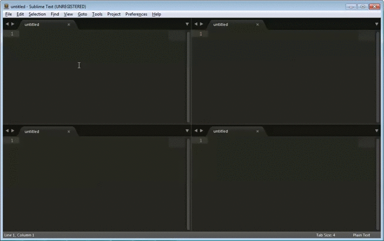

SublimeResizeGroupWithKeyboard
==============================

Sublime Text 2 and 3 Plugin to resize active group with keyboard

## Using

### OSX

 * Press ⌘-⌥-right to expand active group horizontally.
 * Press ⌘-⌥-left to shrink active group horizontally.
 * Press ⌘-⌥-up to expand active group vertically.
 * Press ⌘-⌥-down to shrink active group vertically.

### Windows & Linux:

 * Press ctrl-alt-right to expand active group horizontally.
 * Press ctrl-alt-left to shrink active group horizontally.
 * Press ctrl-alt-up to expand active group vertically.
 * Press ctrl-alt-down to shrink active group vertically.



## Settings
The settings are stored under 
`Preferences / Package Settings / Resize Group With Keyboard / Settings - Default`.
In order to change the default settings, copy the settings to `Settings - Default` 
found under the same menu, and edit their values.

### Setting the resize delta
The resize delta is set to 0.01 by default, similar to 1 % of the entire application window.
Change this to a greater or a smaller value in order to resize the groups accordingly.
```JSON
{ "resize_delta_default": 0.01 }
```

### Per-direction resizing
Optionally, the resize deltas can be set explicitly for each of the directions.
This can be handy you want different resizing with e.g. Up/Down and Left/Right.
For example:
```JSON
{
  "resize_delta_up": 0.01,
  "resize_delta_down": 0.01,
  "resize_delta_left": 0.1,
  "resize_delta_right": 0.1
}
```
